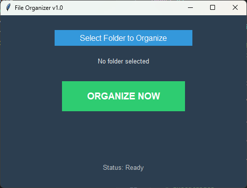

# Automated File Organizer

A simple but powerful Python script to automatically sort files from a single folder (like your 'Downloads' folder) into categorized subfolders based on file type (e.g., images, documents, videos).

## What It Does
This script watches a specified source folder and moves files into destination folders like:
- `.jpg`, `.png`, `.gif` -> `/Images`
- `.pdf`, `.docx`, `.txt` -> `/Documents`
- `.mp4`, `.mov` -> `/Videos`
- ...and so on. It is easily customizable.

## Problem It Solves
Keeps your digital workspace clean and organized automatically, saving you the time and effort of manually sorting dozens or hundreds of files.

## How to Use It
1. Clone this repository.
2. Run the script from your terminal: `python organizer.py`
3. Follow the on-screen prompts to specify your source and destination folders.

## Technologies Used
- Python

## GUI Version

We now have a graphical user interface (GUI) version of the file organizer! This makes the tool more accessible to users who prefer a visual interface.

To run the GUI version:
1. Make sure you have Python installed
2. Run the command: `python gui_organizer.py`
3. The application window will open:
   - Click "Select Folder to Organize" to choose a directory
   - Click "ORGANIZE NOW" to organize the files
   - Status messages will appear at the bottom of the window

### Features
- Simple, clean interface with dark theme
- Real-time status updates
- Error handling with user-friendly messages

### Screenshot

